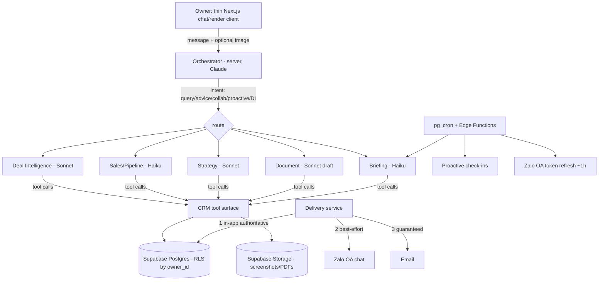

# ARIA — Architecture Spine

> The **invariants** that keep ARIA's epics and stories consistent. Decisions only — rationale lives in the planning conversation. Everything structural (full schema, tool signatures, file tree) is **seed**: true at cold-start, owned by the code once it exists, captured in `addendum.md`. Each `AD-n` carries **Binds** (what it constrains), **Prevents** (the divergence it stops), and **Rule** (the invariant). `[ADOPTED]` = already settled by the PRD, research, or the planning roundtable.

## Paradigm

**Conversational orchestrator over a Postgres system-of-record, with stateless server-side AI and tool-calling specialist reasoning.** The user talks to a thin chat/render client; a single server-side **orchestrator** classifies intent and either answers or routes to specialist reasoning (Deal Intelligence, Sales, Strategy, Document, Briefing). All AI runs server-side via Claude tool-use against a fixed CRM tool surface. The **CRM (Postgres) is the only durable source of truth**; conversations are transient. This paradigm carries the whole model: features are reasoning paths + tools, not independent app modules.

## Invariants (Architecture Decisions)

### AD-1: Orchestrator + tool-calling paradigm `[ADOPTED]`
- **Binds:** every feature; every AI interaction.
- **Prevents:** feature teams inventing bespoke AI-call shapes; client-side AI calls; the CRM becoming one of several competing stores.
- **Rule:** All AI runs server-side. A single orchestrator owns intent classification and routing; specialists reason only through the shared CRM **tool surface** (`addendum.md §C`). No feature reads/writes Claude directly outside this path. The client never calls the Claude API.

### AD-2: Owner-scoping + Row Level Security `[ADOPTED]` *(load-bearing — expensive to reverse)*
- **Binds:** every table, every query, every storage object.
- **Prevents:** cross-owner data leakage; a costly multi-tenancy retrofit (the single decision the roundtable flagged as expensive-to-reverse).
- **Rule:** Every persisted row and storage object carries `owner_id`. Postgres RLS policies filter every table by the authenticated owner. No query path bypasses RLS (no service-role reads in request handlers serving owner data). This is the *only* concession to future multi-tenancy — **no org model, billing, or tenant routing is built** (see Deferred).

### AD-3: Stateless AI, durable state in CRM `[ADOPTED]`
- **Binds:** orchestrator and all specialists.
- **Prevents:** context drift; reliance on chat transcript as source of truth; unbounded prompt growth.
- **Rule:** AI calls hold no server-side session state. Context for any call is reconstructed from (a) the ≤~2,000-token Business Context injection, (b) CRM data fetched via tools for the specific entities in scope, and (c) bounded recent conversation turns (AD-12). Intelligence Fields and activity log in the CRM — never the transcript — are the durable record.

### AD-4: Model routing by task tier `[ADOPTED]`
- **Binds:** every AI call.
- **Prevents:** cost blowout; quality loss on high-judgment tasks.
- **Rule:** Route by task. **Haiku 4.5** ($1/$5 per MTok): briefing generation, deal/client queries, pipeline checks, elicitation, stub creation. **Sonnet 4.6** ($3/$15 per MTok): Deal Intelligence, Strategy, document drafting, **and all vision/screenshot extraction** (routed to Sonnet for judgment quality — Haiku can see, but DI vision is high-judgment). **Deal Intelligence is never downgraded.** Model IDs and the routing table live in `addendum.md §D`.

### AD-5: Prompt-caching discipline `[ADOPTED]` *(load-bearing — the cost ceiling depends on it)*
- **Binds:** how every AI call assembles its prompt.
- **Prevents:** cache misses that blow the $15–35/mo target; the "DI costs $0.05 every call" failure mode.
- **Rule:** The stable prefix — system prompt → tool definitions → Business Context — is **byte-stable** and carries a `cache_control` breakpoint; volatile content (per-deal data, conversation turns, timestamps) comes *after* it. No timestamps/UUIDs/per-request IDs in the prefix; tool list is deterministically ordered; never swap models or tools mid-conversation. Verify cache hits via `usage.cache_read_input_tokens` in observability. Per-DI-call context budget is set here (OQ-11).

### AD-6: Graceful-degradation contract `[ADOPTED]`
- **Binds:** orchestrator, every specialist, briefing, the client.
- **Prevents:** hard failures / infinite spinners when the Claude API is slow, rate-limited, or down (PRD FR-5).
- **Rule:** Every AI-backed operation returns a **standard envelope** — `{ status: ok | degraded | error, data, degraded_reason? }` — so specialists built in different epics degrade identically. AI calls carry a bounded timeout (default ~10s to first token, configurable); on timeout/failure/rate-limit they return `degraded` with structured CRM data, never an unhandled error, and the UI renders a persistent degraded banner. The Briefing always has a cached fallback. No operation hangs indefinitely; a retry affordance is always present.

### AD-7: Scheduler = Supabase pg_cron + Edge Functions `[ADOPTED]`
- **Binds:** Briefing generation, proactive check-ins, Zalo token refresh.
- **Prevents:** redeploy-fragility and per-user scheduling limits of Vercel Cron (research verdict).
- **Rule:** All periodic work runs as `pg_cron` jobs invoking Edge Functions, in `Asia/Ho_Chi_Minh` time, pausable per-deal/owner via a flag column. Scheduled jobs respect owner-scoping and never run for an empty CRM (PRD FR-36). Jobs are **idempotent**: a re-fire, overlapping run, or retry never double-generates a briefing or double-sends a check-in — guarded by a uniqueness key (`briefings` is unique per `(owner_id, date)`; `check_ins` carry a per-`(deal, window)` dedupe key). Vercel Cron is not used.

### AD-8: Proactive delivery — in-app authoritative, Zalo best-effort, email guaranteed `[ADOPTED]`
- **Binds:** Briefing, check-ins, urgency alerts (PRD §4.8).
- **Prevents:** silently lost notifications; Zalo as a single point of failure.
- **Rule:** Delivery writes an **in-app record first** (the authoritative copy), then attempts **Zalo OA chat** (free-text follower messaging — *not* ZNS templates), then guarantees **email**. Zalo is best-effort: it requires a scheduled **~1-hour OA access-token refresh** (AD-7) and is subject to Zalo's messaging-window rule — if delivery cannot be confirmed, email carries the same content. No proactive item is ever dropped.

### AD-9: Vision pipeline `[ADOPTED]`
- **Binds:** PRD FR-9 (screenshot input), Deal Intelligence.
- **Prevents:** storage blowup, repeated image-token cost, PII sprawl.
- **Rule:** Uploaded images go to owner-scoped Supabase Storage with a retention/lifecycle policy (AD-10). Extraction runs once on Sonnet (vision); extracted structured context is written to the CRM. The **raw image is not re-sent** on subsequent turns once extracted (PRD FR-35). Images are compressed (long edge ≤ ~1568px) before the API call; per-extraction tokens are logged. If an image must be referenced across calls, upload once via the Anthropic **Files API** and reference by `file_id` rather than re-encoding — `extract_from_image` accepts either a base64 source or a `file_id` (`addendum.md §C`).

### AD-10: PII handling & Vietnam PDPL posture `[ADOPTED]`
- **Binds:** all PII (client records, conversation content, screenshots) and every AI call that transmits it.
- **Prevents:** unlawful cross-border processing (PDPL penalties up to 5% of revenue; research verdict).
- **Rule:** Governing law is Vietnam's **PDPL (Decree 356/2025, effective 2026-01-01, superseding Decree 13/2023 "PDPD")**. The Owner is **data controller**, ARIA the **processor**. Required before go-live: (1) Anthropic **DPA** executed; (2) a **Cross-Border Data Transfer Impact Assessment** filed with the Ministry of Public Security (Anthropic named as foreign processor); (3) an in-product **privacy notice** stating what is sent to the AI provider; (4) a **retention/delete policy** enforced in Postgres + Storage (Owner-deletable by default). These are gating items for launch, tracked as OQ-10.

### AD-11: Secret custody — server-side only `[ADOPTED]`
- **Binds:** Anthropic API key, Zalo OA credentials + refresh token, email/SMTP creds, Supabase service role.
- **Prevents:** credential leakage to the client or logs.
- **Rule:** All third-party secrets live in server environment/secrets store; never shipped to or reachable from the client; never logged. The Zalo OA refresh token is stored encrypted and rotated by the scheduled refresh job (AD-7/AD-8).

### AD-12: Conversation context management `[ADOPTED]`
- **Binds:** orchestrator.
- **Prevents:** context-window overflow and runaway token cost in long sessions (PRD FR-35).
- **Rule:** Context per AI call = Business Context + tool-fetched entities + a bounded window of recent turns. Beyond a working-context budget — **default: summarize when reconstructed context exceeds ~40K tokens, always keeping the last ~10 turns verbatim** (tunable, OQ-9) — older turns are summarized server-side; the transcript view still shows full history with a divider. "Start new topic" resets the in-memory context while retaining all CRM data. Extracted image content replaces raw images in context (AD-9).

### AD-13: Auth boundary — no service-role on owner-data paths `[ADOPTED]`
- **Binds:** every request handler and Edge Function that touches owner data.
- **Prevents:** an epic silently bypassing RLS by using the Supabase service-role key for owner reads/writes.
- **Rule:** Owner-data access flows through the authenticated owner's RLS-enforced session (AD-2). The service-role key is reserved for narrow, audited system tasks (e.g. a scheduled job acting for a *known* owner) and is **never** used to serve a client request. Auth is Supabase Auth (email/password, v1); unauthenticated access is denied.

### AD-14: CRM write integrity — append-only log, idempotent AI writes `[ADOPTED]`
- **Binds:** Deal Intelligence and CRM (Epics 1–2); every AI-maintained field update.
- **Prevents:** two epics diverging on whether repeated AI writes spam the activity log or clobber human edits.
- **Rule:** The **activity log is append-only** and records only *material* changes (no-op writes log nothing). AI-maintained field updates are **idempotent** and carry provenance (`actor=ai`, source) — a re-run that yields no change writes nothing. Human edits to an AI-maintained field are not silently overwritten: ARIA proposes, the latest explicit human value wins, and genuine conflicts surface to the Owner. Stub→full promotion (PRD FR-37) is a **state transition on the existing record**, never a new record.

## Seed (true at cold-start; owned by code thereafter)

- **Stack:** Next.js 14 (App Router) on Vercel; Supabase (Postgres + Storage + Auth); Anthropic Claude (`claude-haiku-4-5`, `claude-sonnet-4-6`); Supabase Edge Functions + `pg_cron`; PDF via Puppeteer/html-pdf-node serverless; Zalo OA messaging API; transactional email provider. *(Ratified from PRD/addendum + research; verify exact versions at build.)*
- **Data model:** entities and fields in `addendum.md §B` (every table gains `owner_id` + RLS per AD-2; new tables `check_ins`, `stall_diagnosis`/`decision_maker` fields).
- **Tool surface:** `addendum.md §C` (incl. `extract_from_image`, `schedule_checkin`).
- **Model routing table & caching:** `addendum.md §D`.

## Cost model (load-bearing note)

Target **$15–35/month** at solo daily use is achievable **only with AD-5 (caching) + AD-4 (routing) held**. Driver = Deal Intelligence on Sonnet (~$0.05/rich call uncached, ~$0.03 cached) + vision (~$0.004/screenshot). At ~10–20 interactions/day with a minority being DI, the band holds; heavy DI/vision days trend to the top or above. Mitigations are invariants, not options: cache the stable prefix, set a per-DI context budget (OQ-11), keep routine ops on Haiku, cache the daily Briefing. Validate real cost with per-call token logging in the first weeks (OQ-6).

## Deferred (explicitly not deciding now)

- **Multi-tenancy** — org model, tenant routing, billing. AD-2 keeps the door open; nothing built.
- **RAG / pgvector** over the document library — until document volume justifies it.
- **Automated Zalo conversation ingestion** — vision/screenshot + conversational input cover v1 (real API-access risk).
- **Email-reply parsing** for check-in answers — v1 email is outbound-only; answers come in-app/Zalo.
- **Team RBAC / multi-user**, analytics dashboards, mobile push — post-v1 epics.
- **Self-hosted / Managed-Agents** runtime — v1 uses direct Messages API + tool-use; revisit only if orchestration complexity demands it.

## Open Questions (carried + new)

- **OQ-5 — Zalo OA push: operational validation.** Design is settled (AD-8: in-app authoritative, email guaranteed, Zalo best-effort + ~1h token refresh); validate unsolicited-push behavior under the messaging window during Epic 5.
- **OQ-6 — Real Claude cost at heavy DI+vision use.** Validate the band with per-call token logging in weeks 1–4.
- **OQ-9 — Tune the AD-12 summarization threshold** (default ~40K tokens / last ~10 turns) against real usage — a tuning dial, not a blocking branch point.
- **OQ-10 — PDPL go-live items** (DPA, CDTIA filing, privacy notice, retention) — gating for launch.
- **OQ-11 — Per-Deal-Intelligence context budget** that holds cost while preserving read quality.
- **OQ-12 — pg_cron cadences & timezone** for briefing (default ~7:00 ICT) and check-in windows.
- **OQ-13 — Zalo OA app registration** (Official Account setup, API approval) — operational prerequisite for Epic 5.
